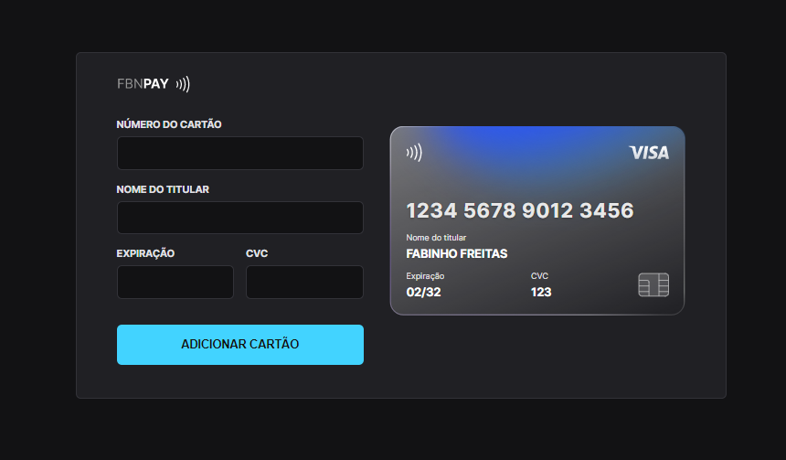

<h1 align="center"> Credit Card Project </h1>

O FBNPay é um projeto de formulário que simula o preenchimento de um cartão de crédito, onde é possível adicionar máscara aos inputs e atualizar elementos HTML via DOM.

  

## 🚀 Technologies

- HTML
- CSS
- JavaScript
- JSON
- Node e NPM
- Vite
- iMask
